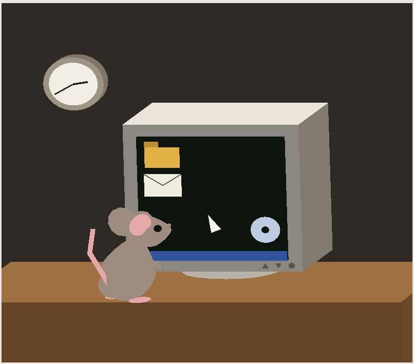

<p align="center"></p>

ratinho.

Requisitos: cena 3D com primitivas próprias, transformações e interação por teclado ([enunciado](enunciado-proj1.pdf)).

Cena: uma mesa com monitor CRT (escala com J/K, translação do cursor com setas), um rato na frente (rotação com A/S) e um relógio na parede.

```
proj1/
├── main.py            # janela, cena e teclado
├── geometria.py       # primitivas: cubo, esfera, cilindro...
├── objetos.py         # monta cada objeto
├── rato.py            # o rato, montado a parte
├── transformacoes.py  # matrizes para transformacoes
└── gl_utils.py        # shaders, vbo, draw calls
```
